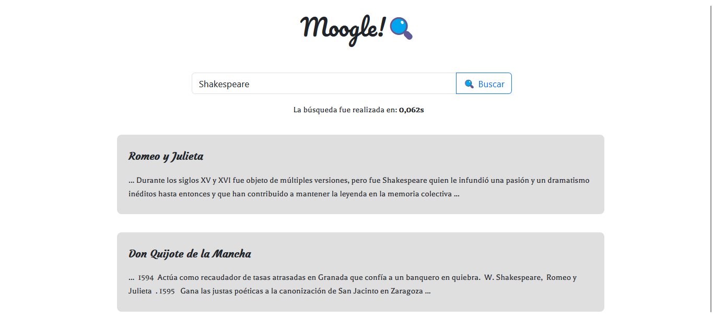

# Moogle!



> Proyecto de Programación I.
> Adrián Alejandro Souto Morales C122
> Facultad de Matemática y Computación - Universidad de La Habana.
> Cursos 2021, 2022.

Moogle! es una aplicación *totalmente original* cuyo propósito es buscar inteligentemente un texto en un conjunto de documentos.

Es una aplicación web, desarrollada con tecnología .NET Core 6.0, específicamente usando Blazor como *framework* web para la interfaz gráfica, y en el lenguaje C#.
La aplicación está dividida en dos componentes fundamentales:

- `MoogleServer` es un servidor web que renderiza la interfaz gráfica y sirve los resultados.
- `MoogleEngine` es una biblioteca de clases donde está... ehem... casi implementada la lógica del algoritmo de búsqueda.


## Ejecutando el proyecto

Lo primero que tendrás que hacer para poder trabajar en este proyecto es instalar .NET Core 7.0. Luego, solo te debes parar en la carpeta del proyecto y ejecutar en la terminal de Linux:

```bash
make dev
```

Si estás en Windows, debes poder hacer lo mismo desde la terminal del WSL (Windows Subsystem for Linux). Si no tienes WSL ni posibilidad de instalarlo, el comando para ejecutar la aplicación es (desde la carpeta raíz del proyecto):

```bash
dotnet watch run --project MoogleServer
```
## Cosas a tener en cuenta:
- Colocar los archivos (".txt") dentro de la carpeta Content. (No agregar subcarpetas!)
- Los nombres de los docs no pueden contener ("/") en el nombre
- Maneja bien grandes cantidades de archivos
